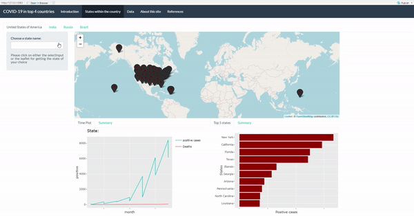

# COVID19top4                 
<!-- badges: start -->
[](https://github.com/etc5523-2020/r-package-assessment-Varsha-Ujjinni-VijayKumar/actions)
[](https://www.gnu.org/licenses/gpl-3.0)
<!-- badges: end -->

The goal of _COVID19top4_ is to launch a shiny application for the coronavirus dashboard which shows the visualizations and analysis for the top 4 COVID affected countries as of October 2020. It contains functions which help launch the application and some UI and server functions for the user to use. There are a couple of datasets for the user to use within the package which also was used for the analysis and visualizations of the shiny app.

## Installation

You can install the  _COVID19top4_ package on GITHUB with:

``` r
# install.packages("devtools")
devtools::install_github("https://github.com/etc5523-2020/r-package-assessment-Varsha-Ujjinni-VijayKumar")
```

## Example

To run the app use the R code mentioned below.

``` r
library(COVID19top4)
launch_app()
```
Below is a basic preview of the app in action.



## Other functions within this package:

#creates a select Input for states:

``` r
stateInput(id,x)
```

#returns leaflet maps:

```r
leaflet_maps(longitude,latitude,state_name,total_cases)
```


This is a basic example which shows you how to you can use the datasets within this package:

```{r}
library(COVID19top4)
corona 
```
## Datasets available

1. corona: This contains filtered data for USA,India, Brazil and Russia from the COVID19 package of CRAN.
1. usa: This contains the cases, recovered for United States of America and its states.
1. india: This contains the number of cases, recovered and deaths for India and its states.
1. brazil: This contains the number of cases, recovered and deaths for Brazil and its states.
1. russia: This contains the number of cases, recovered and deaths for Russia and its states.
1. USA_distinct: Distinct states for USA and their individual counts.
1. IND_distinct: Distinct states for India and their individual counts.
1. BRA_distinct: Distinct states for Brazil and their individual counts.
1. RUS_distinct: Distinct states for Russia and their individual counts.

